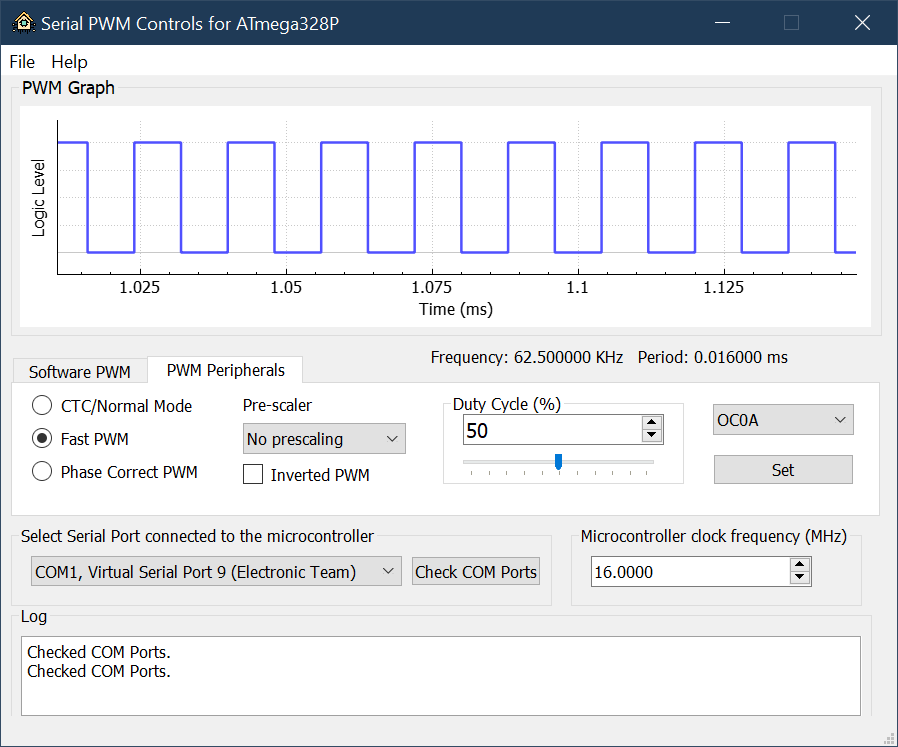
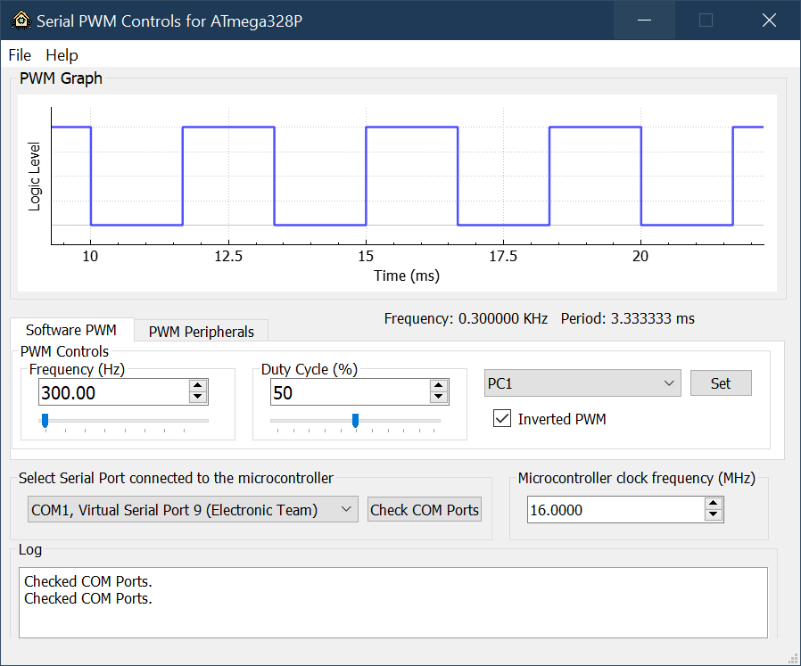
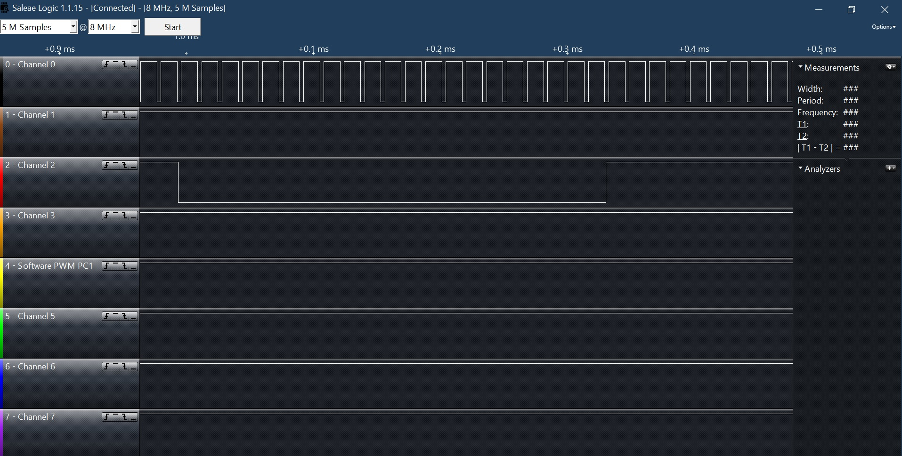

# PWM Controls via serial for ATmega328/Arduino

This is a GUI Application written in C++ using the Qt framework to control frequency & duty cycle of PWM generated by MCU.

Configuration properties are sent via serial in 6-byte packets which enable PWM configuration. The application also demonstrates the ability to save your configuration and load it again later.

## Screenshots

---
## PWM Output from the Arduino using logic analyzer

---
## Note
The code in the application is a bit of a mess and needs to be cleaned up in future commits. The functionality is experimental and use must be used with caution.